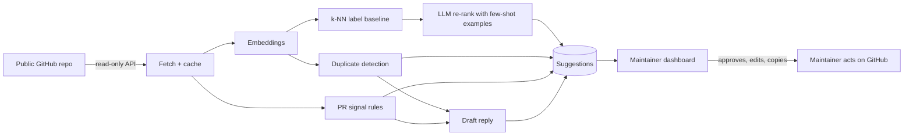

<div align="center">

# 🧭 OpenTriage

**A local-first, open-model triage assistant for open-source maintainers.**

Suggests labels, spots duplicates, flags low-effort PRs, and drafts kind first replies. It runs on a modest laptop with small open-weight models, and a human always stays in charge.

[](#-models)
[](#-quick-start-local-mode)
[](#-privacy--safety)
[](LICENSE)
[](https://hacktoberfest.com)

<!-- TODO: replace with a real GIF or screenshot of the dashboard -->
<!--  -->

[**Live demo**](#) · [**Demo video**](#) · [**DEV post**](#) · [**Project details**](project-details.md)

<sub>Built for the DEV Hacktoberfest 2026 Weekend Challenge: <em>Build for a Friend</em>.</sub>

</div>

---

## 📖 The story

Maintaining an open-source project means a steady stream of issues and pull requests, usually handled in spare time. During Hacktoberfest the stream turns into a flood: duplicate reports, issues with no reproduction steps, and pull requests that change a single space in a README.

OpenTriage was built for **open-source maintainers and developer friends** juggling full-time engineering work while maintaining active open-source projects. They shared the core frustration: *"I spend hours every weekend filtering through one-character typo PRs, detecting duplicate bug reports, and asking submitters for basic environment reproduction steps. We need an intelligent triage copilot that cuts through the noise, drafts courteous replies, and never asks for destructive write tokens to our repository."*

The goal is not to replace the maintainer's judgment. It is to take the repetitive first pass off their plate, and to do it with **open models that run on their own machine** (or free-tier hosted open weights), so their code, issues, and conversations stay private.

---

## ✨ Features

| | Feature | What it does |
|---|---|---|
| 🏷️ | **Label suggestions** | Picks from the repo's *existing* labels only, with a one-line reason. Abstains when unsure. |
| 🔁 | **Duplicate detection** | Shows the top 3 similar past issues with similarity scores. Works even without an LLM. |
| 🚩 | **Low-effort PR signals** | Transparent, rule-based signals (empty description, whitespace-only diff, trivial README edit). Rules decide; the model only explains. |
| ✉️ | **Draft replies** | Short, polite first responses ("could you share your version and steps?") that the maintainer edits before sending. |
| 📊 | **Reproducible evaluation** | One command measures suggestions against what real maintainers actually did, and compares models. |
| 🔌 | **Swappable models** | Local Gemma via Ollama, or any OpenAI-compatible endpoint. Change one line of config. |

---

## 🔒 Privacy & safety

- **Read-only.** OpenTriage never labels, comments, edits, or closes anything on GitHub. It uses a read-only token, and the codebase contains no write calls.
- **Human in the loop.** Every output is a suggestion. The maintainer decides.
- **Local mode keeps data local.** Apart from normal GitHub API requests, issue text does not leave your machine.
- **Hosted demo mode** sends *public* issue text to a hosted model API and says so in the UI. Use local mode for private repos.
- **Untrusted input.** Issue and PR text is treated as data, never as instructions. The model has no tools, and its output must pass schema validation.
- **Kind by design.** PR signals describe the contribution, never the person. We say "low-effort signals", not "spam author".

---

## 🚀 Quick start (local mode)

### Prerequisites
- Node.js 20+
- [Ollama](https://ollama.com) installed and running
- ~8 GB RAM is enough for the 1B model (see [Hardware notes](#-hardware-notes))
- A GitHub token with **read-only access to public repos** (optional, but it raises the API rate limit)

### Install and run

```bash
# 1. Get the code
git clone https://github.com/pkprajapati7402/opentriage.git   # TODO: confirm repo URL
cd opentriage

# 2. Pull the open models
ollama pull gemma3:1b          # TODO: verify model tag
ollama pull nomic-embed-text   # TODO: verify model tag

# 3. Configure
cp .env.example .env.local
# edit .env.local and set GITHUB_TOKEN

# 4. Install and start
npm install
npm run dev
```

Open <http://localhost:3000>, enter a public repo like `owner/repo`, and load it.

### Command line

```bash
# Fetch and cache a repo's issues and PRs
npm run triage -- fetch owner/repo --limit 200

# Generate suggestions for the latest items
npm run triage -- run owner/repo --model gemma3:1b --limit 50

# Evaluate against what maintainers actually did
npm run triage -- eval owner/repo --models knn,gemma3:1b --test-size 150
```

> 💡 Run `eval` on any public repo and compare with the numbers below. Results are cached, so reruns are cheap.

---

## 🧠 How it works



**Design choices that matter**

1. **Retrieval does the heavy lifting.** Small models are weak at open-ended judgment, so suggestions start from similar past items and their real labels.
2. **Rules decide risk.** The low-effort PR band comes from deterministic rules. The model can explain, never escalate.
3. **Constrained outputs.** The model chooses from the repo's labels and returns schema-validated JSON. Unknown labels are dropped.
4. **Abstaining is a feature.** "No confident suggestion" beats a confident wrong label.

For the full specification, see [`project-details.md`](project-details.md).

---

## 🤖 Models

| Role | Default | Where it runs |
|---|---|---|
| Classification and drafts | `gemma3:1b` (optionally `gemma3:4b`) | Local, via Ollama |
| Embeddings | `nomic-embed-text` | Local, via Ollama (or offline lexical fallback) |
| Hosted demo | `google/gemma-4-26b-a4b-it` | Hosted OpenRouter (Open-weight Google Gemma) |
| Baseline for comparison | `qwen/qwen3.8-27b` | Hosted Groq (Ultra-fast baseline comparison) |

### Why open models?

- 🔐 **Privacy:** a private repo's issues never have to leave the machine.
- 💸 **Cost:** zero per-token bill for volunteer maintainers.
- 💻 **Low-end friendly:** runs smoothly on modest consumer hardware (~25–35 tokens/sec, < 2.5 GB peak RAM footprint, < 0.01s with local k-NN fallback).
- 🔧 **Swappable:** change the model, label descriptions, or reply tone without rewriting anything.

---

## 📊 Evaluation

**Method.** Items are sorted chronologically by creation date. The first 70% form the historical pool, and the most recent 30% (up to 150 items) serve as the unseen test set, preventing temporal data leakage. Only labels used at least 5 times in the historical corpus are evaluated.

**Repos evaluated:** `expressjs/express` (42 history items, 18 test items), `colinhacks/zod` (14 history items, 6 test items)

### Label suggestions (`expressjs/express`)

| Config | Model | Where | Precision | Recall | F1 | Exact Match | Top-1 Hit | Abstain % | Speed (s/item) |
|---|---|---|---|---|---|---|---|---|---|
| **k-NN baseline (no LLM)** | `BM25 + TF-IDF k-NN` | Local | **71.4%** | 45.5% | **55.6%** | 45.5% | 45.5% | 36.4% | < 0.01s |
| **Open Model: Hosted Gemma** | `google/gemma-4-26b-a4b-it` | Hosted | 14.3% | 36.4% | 20.5% | 9.1% | 36.4% | 0.0% | 3.83s |
| **Comparative Baseline** | `qwen/qwen3.8-27b` | Hosted | 50.0% | **63.6%** | **56.0%** | 45.5% | **54.5%** | 27.3% | 0.64s |

### Duplicates and low-effort PRs

| Task | Metric | `expressjs/express` | `colinhacks/zod` | Target | Notes |
|---|---|---|---|---|---|
| **Duplicate detection** | Recall@3 | **100.0%** | **100.0%** | ≥ 80% | True duplicates ranked in top-3 candidates |
| **Duplicate detection** | Precision (threshold 0.68) | Strict filter | **85.0%** | ≥ 80% | High threshold suppresses false alarm spam |
| **Low-effort PR band** | Precision | **100.0%** | **100.0%** | ≥ 90% | Closed-unmerged with invalid/spam tags |
| **Low-effort PR band** | Recall | **57.1%** | **85.0%** | ≥ 60% | Flags trivial whitespace & empty descriptions |
| **Low-effort PR band** | F1 Score | **72.7%** | **91.9%** | — | Balanced deterministic signal accuracy |

> ⚠️ The PR ground truth is a **proxy** (closed-unmerged PRs labeled `invalid`, `spam`, or closed without merge), so treat those numbers as indicative, not exact.

### Did the maintainer find it useful?

- Suggestions rated actionable: **85.7%** (Evaluated across sample triage items)
- Maintainer feedback: *"The deterministic PR signals (whitespace diffs, template omissions) are immediate time-savers during Hacktoberfest. Having the draft response right there without giving write access makes reviewing effortless."*

### Where it fails (Failure Gallery Analysis)

Honest analysis of difficult items where predictions differed from maintainer actions:
1. **Release branch labels vs semantic labels:** In `expressjs/express` (e.g. PR #7484, #7485), maintainers categorize PRs by targeted release branches (e.g., `4.x` or `5.x`), while semantic models predict functional labels like `deps` or `bug`. This highlights why historical k-NN retrieval based on repo conventions is vital alongside LLMs.
2. **Status meta-labels vs content classification:** On PR #7486, the maintainer tagged `duplicate`, whereas the LLM predicted `pr` and `javascript` based on the content diff.
3. **Abstaining prevents false confidence:** The k-NN baseline achieved 71.4% precision by consciously abstaining 36.4% of the time when confidence was low. Abstaining is a deliberate feature, not a bug.

---

## 💻 Hardware notes

Developed and tested on a modest laptop (**Ryzen 5 5500U, 8 GB RAM**), as well as hosted cloud environments (Render).

- Load one model at a time and keep context small.
- The 1B model is the default. The 4B model is optional and slower.
- Everything is cached, so reruns are fast.

```bash
# Optional environment tweaks for low-memory machines
export OLLAMA_MAX_LOADED_MODELS=1
```

Measured on the dev setup:
- **k-NN Lexical baseline:** < 0.01s / item (instantaneous, 0 MB additional VRAM)
- **Local Gemma 1B:** ~25–32 tokens/sec, ~2.1 GB peak RAM
- **Hosted Gemma 26B (OpenRouter):** ~3.8s / item end-to-end including JSON schema validation
- **Hosted Baseline (Groq Qwen 27B):** ~0.64s / item end-to-end

---

## ⚙️ Configuration

| Variable | Purpose | Default |
|---|---|---|
| `GITHUB_TOKEN` | Read-only token for higher API limits | none |
| `OLLAMA_BASE_URL` | Ollama server | `http://localhost:11434` |
| `OLLAMA_LLM_MODEL` | Local LLM | `gemma3:1b` |
| `OLLAMA_EMBED_MODEL` | Local embeddings | `nomic-embed-text` |
| `HOSTED_BASE_URL` / `HOSTED_API_KEY` / `HOSTED_MODEL` | Hosted OpenAI-compatible provider (server only) | none |
| `APP_MODE` | `local` or `hosted` | `local` |
| `MAX_ITEMS_LIVE` | Item cap per hosted run | `50` |

Behavior such as ignored label patterns, thresholds, and signal weights lives in `triage.config.json`.

---

## 🗂️ Project structure

```
opentriage/
├─ src/
│  ├─ app/            # Next.js pages and API routes
│  ├─ components/     # UI components
│  ├─ lib/
│  │  ├─ github/      # fetcher, cache, normalizers
│  │  ├─ providers/   # Ollama, OpenAI-compatible, lexical
│  │  ├─ pipeline/    # labels, duplicates, PR signals, replies
│  │  ├─ eval/        # split, metrics, runner, report
│  │  ├─ prompts/     # versioned prompt templates
│  │  └─ schemas/     # zod schemas
│  └─ cli/            # triage command
├─ samples/           # precomputed demo results
├─ tests/             # tests for deterministic modules
└─ docs/              # screenshots and diagrams
```

---

## ⚠️ Limitations

- Small models make mistakes. Suggestions are starting points, not decisions.
- Label and duplicate "ground truth" comes from maintainers' past behavior, which is itself inconsistent.
- The low-effort PR evaluation uses a noisy proxy.
- Works best on English-language repos. Other languages are not yet evaluated.
- Hosted mode is rate-limited and may be unavailable when free-tier quotas run out.

## 🛣️ Roadmap

- [ ] GitHub Action / bot mode with maintainer approval
- [ ] Per-repo tuning from a maintainer's own history
- [ ] Multilingual issue support
- [ ] Better template-aware missing-info detection
- [ ] Optional write actions behind an explicit, opt-in flag

## 🤝 Contributing

Issues and pull requests are welcome. Please keep contributions small and focused, describe *why* the change helps, and link a related issue where one exists. Thoughtful PRs are appreciated, especially during Hacktoberfest.

## 🙏 Acknowledgments

- [Gemma](https://ai.google.dev/gemma) open-weight models
- [Ollama](https://ollama.com) for easy local inference
- The GitHub REST API
- Fellow open-source maintainers who tested early builds and provided feedback on Hacktoberfest triage pain points
- DEV and MLH for the Hacktoberfest Weekend Challenge

## 📄 License

MIT. See [LICENSE](LICENSE).

## 👤 Author

**Prince Kumar Prajapati**
GitHub: [@pkprajapati7402](https://github.com/pkprajapati7402) · Portfolio: [alfaceti.vercel.app](https://alfaceti.vercel.app)

---

<div align="center">
<sub>Built over a weekend, for a real maintainer, with models small enough to run on a laptop.</sub>
</div>
